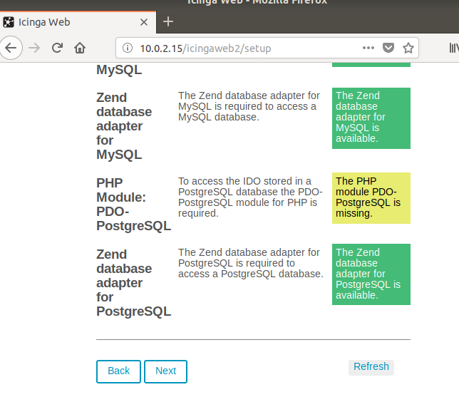
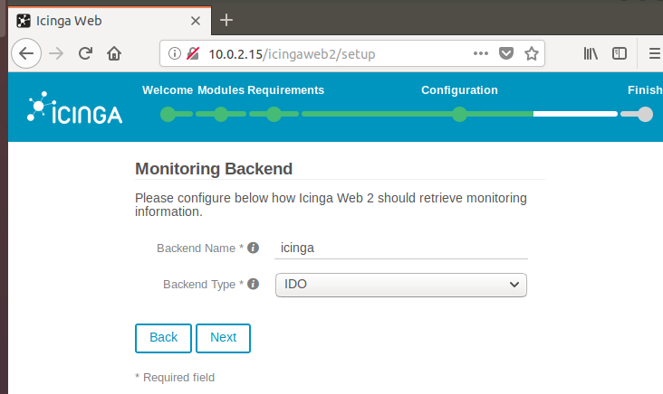
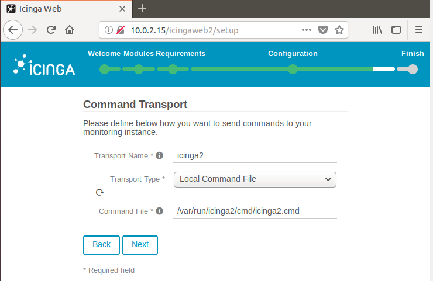
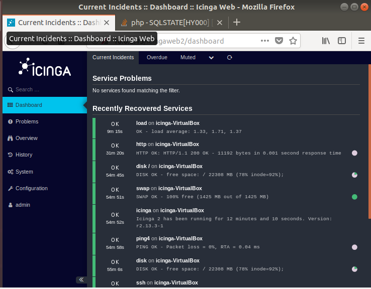

# Icinga
Instalación

Primero debemos de instalar un servidor Lamp

Una vez instalado el servidor lamp procederemos con la instalación de Icinga con el siguiene comando

Marcamos la opción "Si"

Ahora proporcionamos la contraseña de de nuestro servidor de Icinga

Marcamos la opción "Si" 

Ahora debemos de habilitar funciónes de icinga2 mysql usando los siguientes comandos

Con el siguiente comando comprobaremos estado de icinga

Ahora procederemos a instalar IcingaWeb con el siguiente comando

Una vez descargado editaremos el fichero php de apache y cambiaremos la opcion date.time zone y añadiremos "Europe/London" y quitaremos el ; del parametro

Reiniciaremos apache

Con el siguiente comando generaremos el token de nuestro servidor el cual deberemos de guardar para usar mas adelante

Ahora desde un navegador accederemos con nuestra ip o con localhost en la siguiente ruta y nos pedira el token que acabamos de crear

Seleccionamos la opcion de "Monitoring" y marcamos next

Comprobaremos que los requisitos esten correctos y pulsamos next

En el desplegable debera de aparecer Database

Ahora crearemos el usuario de la base de datos admin

Para crear la base de datos nos pedira nuestro usuario root de nuestra maquina

Ahora escribiremos el nombre de nuestro servidor

Volveremos a escribir nuestro usuario de la base de datos admin

Escribiremos de nuevo el nombre de nuestro servidor y marcamos next

Pulsamos next en las siguientes capturas

Ahora escribimos el nombre de nuestra base de datos y añadiremos nuestro usuario root

Y volveremos a pulsar next hasta que se termine la instalación

Y habremos instalado el servidor web de Icinga

Iniciamos sesion con el usuario admin

Y habremos entrado en Icinga

Para monitorizar el otro equipo debermos acceder al siguiente archivo y añadir su ip

Despues de añadir su ip accederemos alsiguiente fichero y añadiremoslos servicios que queremos monitorizar

Reiniciamos el servicio de icinga

Y se visualizara la maquina que hemos añadido

Enlace a [Documentacion](..)