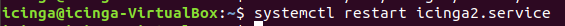

# Icinga
Monitorización

Para monitorizar el otro equipo debermos acceder al siguiente archivo y añadir su ip

Despues de añadir su ip accederemos al siguiente fichero y añadiremoslos servicios que queremos monitorizar

Reiniciamos el servicio de icinga

Y se visualizara la maquina que hemos añadido

