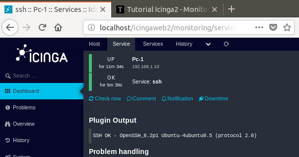

# Icinga
Monitorización

Para monitorizar un servicio de red deberemso añadirlo en el archivo /services.conf. 

Por ejemplo añadiremos el servicio SSH:

Reiniciamos el servicio de icinga

Y se visualizara el estado del servicio SSH del otro equipo.

