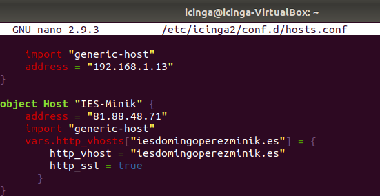
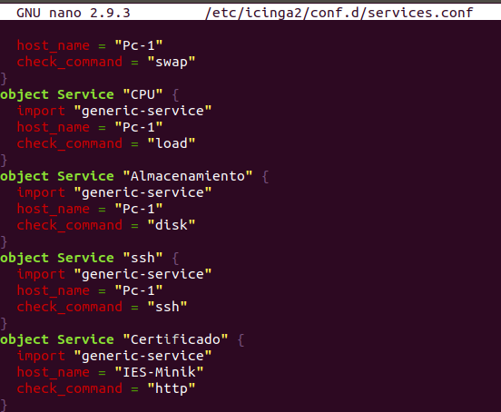
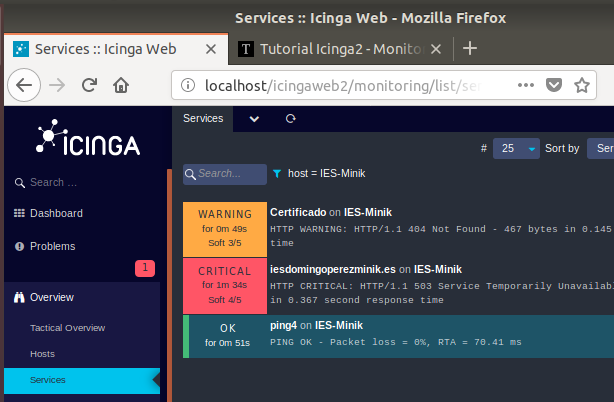
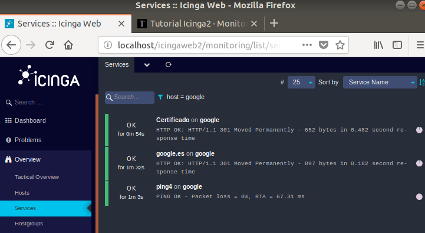

# Icinga
Monitorización

Para monitorizar una Web deberemos añadir la ip y la direccion de la pagina que vamos a monitorizar en el fichero /hosts.conf de la siguiente forma. 

Ahora deberemos de añadir en el archivo /services.conf el servicio que monitorizara el estado de la web.

Escribiremos solamente la opcion certificado:

Reiniciamos el servicio de icinga

Y se deberia de visualizarse el estado de la web.

Para comprobar que funciona he hecho lo mismo pero con la pagina de google.es

